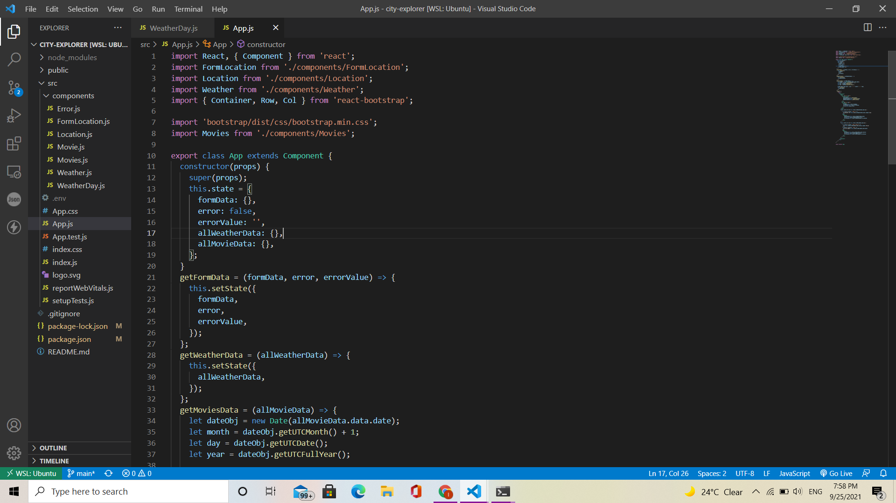
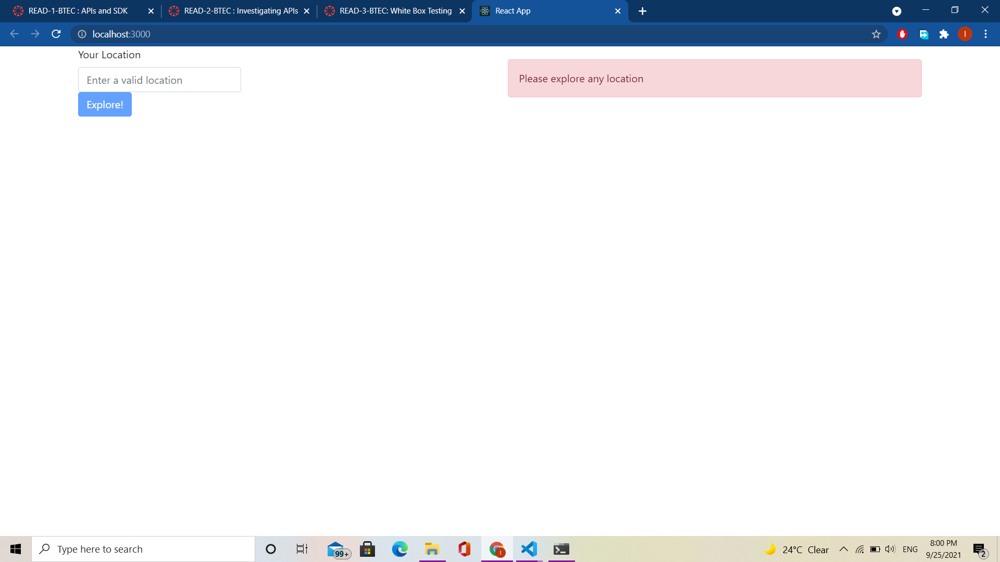

# White Box Testing

what is white box testing ?

White-box testing (also known as clear box testing, glass box testing, transparent box testing, and structural testing) is a software testing method that examines an application's internal structures or workings rather than its functionality (i.e. black-box testing). In white-box testing, test cases are created using an internal perspective of the system as well as programming skills. The tester selects inputs from which to exercise code routes and identify expected outputs. Testing nodes in a circuit, such as in-circuit testing, is equivalent to this (ICT).
In the software testing process, white-box testing can be used at the unit, integration, and system levels. Although conventional testers thought of white-box testing as being done at the unit level, it is now more commonly utilized for integration and system testing. During a system–level test, it can test paths within a unit, paths between units during integration, and paths between subsystems. Though this technique of test design can find numerous faults or problems, it has the ability to overlook elements of the specification that have not been implemented or criteria that have not been met. When it comes to white-box testing, it's all about the design.

testing :

testing bootstarp library :

after installing the library and checking if there are any errors in the implementation

-------------------------------------------------------

references

<https://en.wikipedia.org/wiki/White-box_testing>
